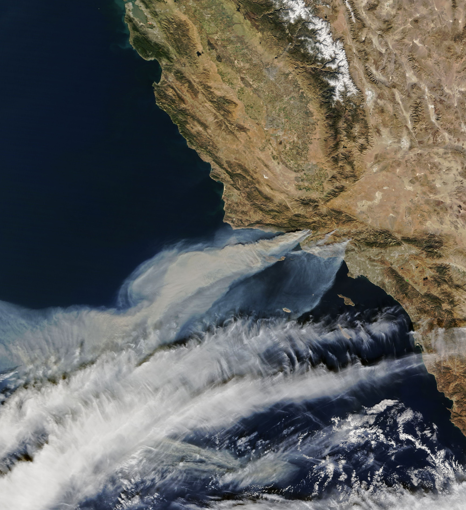

# Visualizing Fire Scars Through False Color
*This repository was produced as a part of the UCSB MEDS program for EDS 220: Working with Environmental Datasets.*

## About
This repository contains two notebooks `hwk4-task2-fire-perimeter-RUBINSTEIN.ipynb` `hwk4-task2-false-color-RUBINSTEIN.ipynb` visualizing the fire perimeter and burn scar, using true and false color imagery from the 2017 Thomas Fire. This exercise involves:
- Cleaning data
- Label-based selection
- Geospatial file creation
- `rioxarray` raster file manipulation 
- True color imagery plotting
- False color imagery plotting



## Repository Structure
```
eds220-hwk4
│   README.md
|   hwk4-task2-fire-perimeter-RUBINSTEIN.ipynb
│   hwk4-task2-false-color-RUBINSTEIN.ipynb
│   thomas-fire-blogspot.ipynb
|   .gitignore
│
└───data
    │   thomasfire.geojson
└───images
    │   Satellite_image_of_Thomas_Fire.jpg
```
## Data
Fire perimeter data was obtained from CalFire's Historical Fire Perimeters dataset. Landsat data was provided as a part of this exercise and accessed from UCSB Bren's Taylor server at `/courses/EDS220/data/hwk4_landsat_data landsat8-2018-01-26-sb-simplified.nc`

## References
- Fire Resource and Assessment Program. (2024). *Historical Fire Perimeters.* CalFire. https://www.fire.ca.gov/what-we-do/fire-resource-assessment-program/fire-perimeters. Accessed: November 23, 2024.
- NASA Landsat 8 (2024). *Landsat Collection 2 Level-2 Science Products.* Microsoft Planetary Computer. https://planetarycomputer.microsoft.com/dataset/landsat-c2-l2. Accessed: November 23, 2024.
- Galaz-Garcia, Carmen. (2024). *EDS 220 Assignment 4.* UCSB MEDS. https://meds-eds-220.github.io/MEDS-eds-220-course/assignments/assignment4.html. Accessed: November 23, 2024.